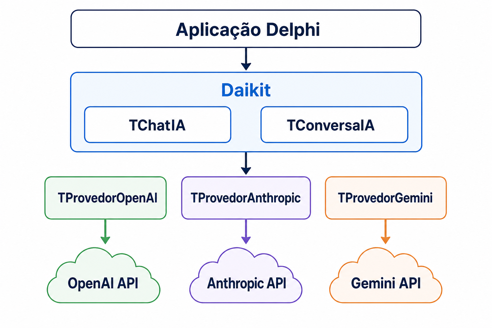
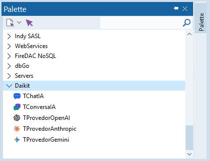
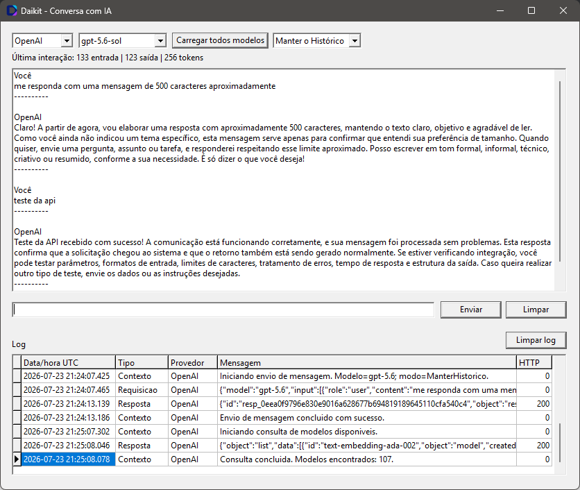

<h1> Daikit</h1>

Biblioteca didática de componentes Delphi para conversar com diferentes provedores de IA por uma API única. A evolução planejada inclui componentes para clientes e servidores MCP.

O projeto usa somente recursos nativos do Delphi, sem componentes de terceiros, Indy ou DLLs adicionais.

O nome **Daikit** combina **D**, de Delphi, **AI**, de *Artificial Intelligence*, e **Kit**, por reunir em uma única suíte os componentes necessários para integrar aplicações Delphi a diferentes serviços de inteligência artificial.

## Visão rápida

Uma aplicação utiliza os componentes centrais do Daikit, escolhe um provedor e conversa com sua API sem precisar conhecer os contratos específicos de cada serviço.

<p align="center">
  
</p>

## Funcionalidades atuais

- Componentes não visuais para OpenAI, Anthropic e Google Gemini;
- troca de provedor sem alterar o código de conversa;
- Envio e consulta de modelos assíncronos, sem bloquear a VCL;
- Histórico compartilhável ou mensagens isoladas;
- Contratos JSON tipados com serialização automática por `REST.Json`;
- Transporte HTTPS nativo baseado em `THTTPClient`;
- Cancelamento cooperativo, timeouts e limites de resposta;
- Log de contexto, requisição, resposta e erros pelo evento `AoRegistrarLog`;
- Credenciais em memória ou variáveis de ambiente, sem persistência no DFM;
- Interfaces e injeção de dependência;
- Testes unitários DUnitX sem acesso à rede;
- Suporte a aplicações Win32 e Win64.

## Componentes

- `TChatIA`: fachada para selecionar o provedor, carregar modelos, enviar mensagens e cancelar operações.
- `TConversaIA`: mantém e compartilha o histórico, com eventos para acompanhar suas alterações.
- `TProvedorOpenAI`: configura a integração com a OpenAI.
- `TProvedorAnthropic`: configura a integração com a Anthropic.
- `TProvedorGemini`: configura a integração com o Google Gemini.

Os cinco componentes aparecem na página **Daikit** da Tool Palette. O registro dos componentes não acessa a rede nem lê credenciais.

<p align="center">
  
</p>

## Requisitos

- Delphi 12 Athens;
- Windows;
- Plataforma Win32 ou Win64;
- DUnitX fornecido com o Delphi para executar os testes.

## Instalação

### Usando uma release

1. Baixe o instalador e o respectivo arquivo `.sha256` na página de [releases do Daikit](https://github.com/jsousaliz/daikit/releases/latest).
2. Se a release for a v0.1.0, por exemplo, confira o SHA-256 do executável:

   ```powershell
   Get-FileHash .\Daikit.Instalador-0.1.0.exe -Algorithm SHA256
   ```

3. Feche todas as instâncias do Delphi.
4. Execute `Daikit.Instalador-[versao-release].exe`.
5. Confirme que o instalador localizou o Delphi 12 e clique em **Instalar**.
6. Abra o Delphi e confirme a página **Daikit** na Tool Palette.

O instalador não possui assinatura digital. O Microsoft Defender SmartScreen pode informar que o aplicativo não é reconhecido. Prossiga somente se o arquivo tiver sido baixado da release oficial e o SHA-256 corresponder ao valor publicado.

O instalador configura automaticamente:

- BPLs de design e runtime Win32 em `$(BDSCOMMONDIR)\Bpl`;
- BPL de runtime Win64 em `$(BDSCOMMONDIR)\Bpl\Win64`;
- DCPs e DCUs em `$(BDSCOMMONDIR)\Dcp\Daikit\Win32` e `Win64`;
- Os diretórios Daikit no `Search Path` de cada plataforma, sem duplicá-los;
- A BPL de design em `Known Packages` para o usuário atual.

Não é necessário adicionar os fontes ao projeto ou ao `Search Path`. Quando **Link with runtime packages** estiver habilitado, as BPLs de runtime utilizadas pela aplicação também deverão ser distribuídas conforme as regras usuais do Delphi.

### Gerando o instalador localmente

Feche o Delphi e execute na raiz do repositório:

```powershell
.\tools\instalador\Construir.ps1
```

O processo:

1. Compila `DaikitRuntimeD12` para Win32 e Win64;
2. Compila `DaikitDesignD12` para Win32;
3. Reúne BPLs, DCPs e DCUs por plataforma;
4. Incorpora esses arquivos ao instalador como um payload compactado;
5. Compila o instalador VCL em modo Release.

O resultado fica em:

```text
tools\instalador\bin\Win32\Daikit.Instalador.exe
```

O executável é autocontido; os fontes e a pasta `packages` não precisam acompanhá-lo na distribuição.

### Desinstalação

1. Feche o Delphi.
2. Execute novamente o instalador.
3. Clique em **Desinstalar** e confirme.

O processo remove o registro do pacote, os arquivos Daikit instalados e somente as entradas Daikit adicionadas ao `Search Path`.

## Uso básico

Em tempo de design, coloque no formulário ou data module:

- Um `TChatIA`;
- Um `TConversaIA`;
- Os provedores que deseja utilizar.

Aponte `ChatIA.Conversa`, escolha o provedor e envie a mensagem:

```pascal
ChatIA.Conversa := ConversaIA;
ChatIA.Provedor := ProvedorOpenAI;
ChatIA.Enviar('Quem é você?');
```

Para continuar a mesma conversa em outro provedor:

```pascal
ChatIA.Provedor := ProvedorAnthropic;
ChatIA.Enviar('Continue a conversa.');
```

`Enviar` inicia uma operação em uma thread de trabalho. A resposta é entregue em `AoReceberResposta`, falhas em `AoOcorrerErro` e o encerramento em `AoConcluir`. Os eventos são entregues na thread principal e podem atualizar controles VCL diretamente.

Use `Cancelar` para solicitar o cancelamento. Um segundo envio é recusado enquanto `Estado` for `Executando` ou `Cancelando`.

O padrão é `ModoConversa = ManterHistorico`. Use `MensagemIsolada` para não adicionar a troca ao histórico e `LimparHistorico` para iniciar uma nova conversa.

`TConversaIA` também oferece:

- `AoAdicionar`: recebe a mensagem adicionada;
- `AoLimpar`: ocorre quando um histórico com conteúdo é limpo;
- `AoAlterar`: sinaliza qualquer mudança efetiva no contexto.

## Modelos disponíveis

`TChatIA.CarregarModelos` consulta assincronamente o provedor selecionado. O resultado é entregue na thread principal por `AoReceberModelos`:

```pascal
procedure TFormPrincipal.ChatIAAoReceberModelos(Sender: TObject;
  const AModelos: TArray<IModeloIA>);
var
  LModelo: IModeloIA;
begin
  ComboModelo.Clear;
  for LModelo in AModelos do
    ComboModelo.Items.Add(LModelo.Id);
end;

procedure TFormPrincipal.CarregarModelos;
begin
  ChatIA.Provedor := ProvedorOpenAI;
  ChatIA.CarregarModelos;
end;
```

Os componentes de provedor expõem `EndpointModelos`, permitindo usar gateways e proxies. `ModeloPadrao` é utilizado quando `ChatIA.Modelo` estiver vazio.

## Credenciais

Por padrão, os provedores procuram estas variáveis de ambiente:

```text
OPENAI_API_KEY
ANTHROPIC_API_KEY
GEMINI_API_KEY
```

Também é possível informar `ChaveAPI` em tempo de execução. Seu getter retorna uma máscara e a propriedade não é gravada no DFM.

Não coloque chaves em fontes, DFMs, argumentos de linha de comando ou arquivos versionados. Se uma chave for exposta, revogue-a no provedor correspondente.

## Log

`TChatIA.AoRegistrarLog` recebe todos os registros produzidos pelo componente e pelo transporte. O objeto `IEventoLogIA` informa:

- `DataHoraUTC`;
- `Tipo`: `Contexto`, `Requisicao`, `Resposta`, `RespostaErro` ou `Erro`;
- `Provedor`;
- `Mensagem`;
- `StatusHTTP`.

Para declarar o handler manualmente, inclua `Daikit.Aplicacao.Log` na cláusula `uses`:

```pascal
procedure TFormPrincipal.ChatIAAoRegistrarLog(Sender: TObject;
  const AEvento: IEventoLogIA);
begin
  MemoLog.Lines.Add(AEvento.Mensagem);
end;
```

O Daikit não filtra nem persiste eventos. A aplicação decide o que mostrar ou armazenar. JSON, exceções e credenciais passam pela sanitização correspondente antes da exposição.

## Exemplo VCL

Abra [Daikit.ExemploVCL.dproj](examples/VCL.Conversa/Daikit.ExemploVCL.dproj). O exemplo demonstra:

- Troca entre os três provedores;
- Seleção do modelo;
- Histórico ou mensagem isolada;
- Uso das unidades retornadas pelo provedor;
- Consumo e exibição dos logs em um `TDBGrid`.

<p align="center">
  
</p>

## Testes

Abra [Daikit.Testes.dproj](tests/testes/Daikit.Testes.dproj), selecione Win32 ou Win64 e compile.

Os executáveis são gerados em:

```text
tests\bin\Win32\testes\Daikit.Testes.exe
tests\bin\Win64\testes\Daikit.Testes.exe
```

Os testes automatizados usam transportes falsos e não consomem APIs pagas. O workflow de release compila e executa a suíte nas duas plataformas antes de publicar o instalador.

## Arquitetura

O domínio trabalha apenas com contratos canônicos. Cada provedor implementa `IAdaptadorIA` e converte seus próprios contratos JSON. Assim, um novo provedor pode ser adicionado sem alterar o serviço de conversa nem os componentes existentes.

O transporte HTTP nativo é isolado por interface e o log usa um Decorator sobre `ITransporteHTTP`, mantendo observabilidade e comunicação separadas dos adaptadores.

## Estado do projeto

O chat textual com OpenAI, Anthropic e Gemini está implementado.

Streaming, ferramentas, MCP, RAG, embeddings, áudio e geração de imagens permanecem como evoluções futuras.
